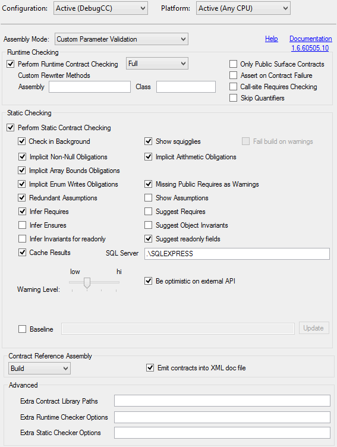
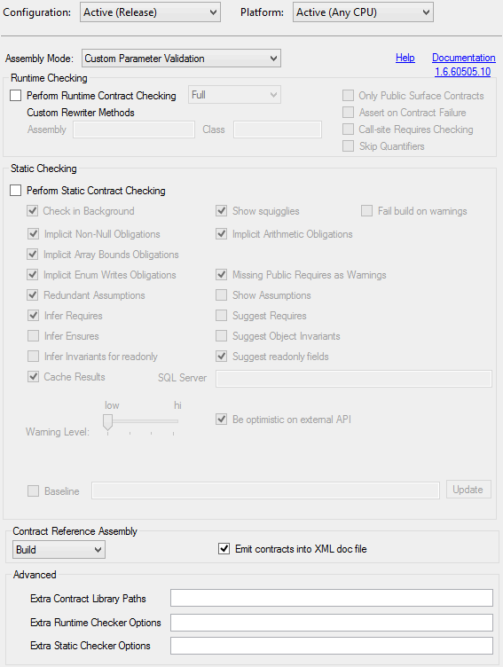
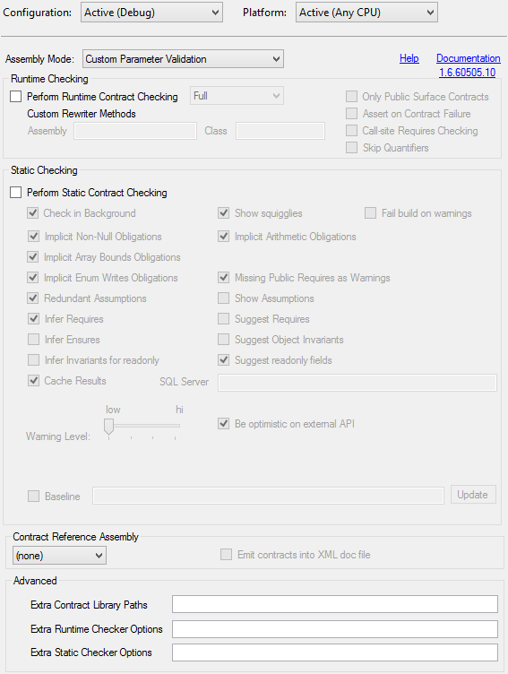
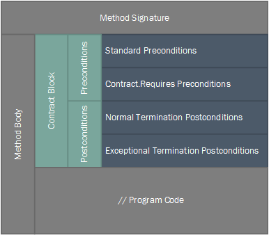

Title: Using Code Contracts from New Project to NuGet
Published: 6/24/2014
Tags:
  - dotnet
  - C#
  - CodeContracts
---

## Introduction

It can be very difficult to trust code written by others and especially myself.
I write tests because I know I will make mistakes and I expect my colleagues to do the same.
Tests and {insert-letter-here}DD approaches go a long way to ensure that code is correct
but I don't think they are the one true path to salvation.
I still find flaws in tested code when I accidentally trip over corner cases.

```csharp
string text = "hello";
int num = 20;
int selection = 11;
int[] indices = RandomIndices(text.Length,num);
int index = indices[selection];
char someLetter = text[index];
```

Consider the above contrived example.
I could make all kinds of tests pass for this code but I still have a bad feeling about it.
Aside from it being terrible code there are so many opportunities for null and index related exceptions.
I can't tell from looking at this code the relationships and restrictions for the parameters, variables and results.
In these situations it can be hard to find all of the corner cases to test for and mistakes that have been overlooked.

Code Contracts is Microsoft's implementation of [Design by Contract](https://en.wikipedia.org/wiki/Design_by_contract)
for VB and C#. Using the [System.Diagnostics.Contracts Namespace](http://msdn.microsoft.com/en-us/library/system.diagnostics.contracts(v=vs.110).aspx)
included with .NET 4.0 and the [Code Contracts](http://research.microsoft.com/en-us/projects/contracts/) tools you can further
define the behavior of your software and verify it at compile time as well as run time.
With Code Contracts I can prove at _compile time_ that the nasty example above does not throw
or at least define the domain in which it won't.

## Getting Started

### What You Need

* Visual Studio Pro or more expensive
* .NET 4.0 or later
* [Code Contracts](http://research.microsoft.com/en-us/projects/contracts/)

While the Code Contracts tools are free they may not be installed in Express Editions of Visual Studio.
Also because the API for Code Contracts is within the .NET Framework 4.0,
you must be able to reference at least .NET 4 .
So far I have used the tools with Visual Studio 2010, 2012, and 2013 and can confirm that they work.
With all that said you don't need to feel bound to a paid version of Visual Studio forever.
If in the future you can't afford the next paid version of Visual Studio you will likely
lose access to the Code Contracts tools but your code will still compile and run (so long as you don't use the generic forms of Contract.Requires).

### Build Configurations

By default your projects will have a Debug and Release configuration.
The debug build can be used for development and testing while the release build is what you would likely run in production or distribute to others.
While you can use Code Contracts with these two configurations I find it inconvenient.
When I work with a debug build I like to run the application and tests frequently and quickly but the Code Contracts tooling gets in the way of this.
My solution is to have three configurations by adding a DebugCC configuration.
Each of the three configurations has different settings with respect to Code Contracts.

<dl>
    <dt>Debug</dt>
    <dd>
        The primary configuration is the standard Debug configuration which has no additional build steps related to Code Contracts and is for standard development and testing.
    </dd>
    <dt>Release</dt>
    <dd>
        This is the standard Release configuration but with one minor addition in the case of a library.
        While Code Contracts tooling is not run on the resulting assembly a second contract assembly can be produced for distribution.
    </dd>
    <dt>DebugCC</dt>
    <dd>
        The DebugCC configuration is based on the Debug configuration but has Code Contracts tooling enabled.
        I periodically build and test with this configuration, often when I reach a stopping point.
    </dd>
</dl>

Create the extra configuration for _the solution_:

1. Within Visual Studio navigate to "Build" &darr; "Configuration Manager..." (or `ALT+B+O`).
2. Select the "&lt;New...&gt;" item from the "Active solution configuration" drop down
3. Enter "DebugCC" in the "Name" field
4. Copy settings from "Debug"
5. Check the "Create new project configurations" check box if no projects have this configuration yet (none should)
6. Click "OK"

Create the extra configuration for _projects added later_:

1. Within Visual Studio navigate to "Build" &darr; "Configuration Manager..." (or `ALT+B+O`)
2. Select the "DebugCC" item from the "Active solution configuration" drop down
3. Click on the configuration for projects that do not have a "DebugCC" configuration associated and select "&lt;New...&gt;"
4. Enter "DebugCC" in the "Name" field
5. Copy settings from "Debug"
6. Click "OK"

You have to configure Code Contracts for each project that you want to use it for.
I configure each of the three configurations differently.

Access the Code Contracts project property sheet.

1. Install Code Contracts if you have not already.
2. Right click on a project and select "Properties" from the context menu (or `ALT+Enter`)
3. Select the tab on the left for "Code Contracts"

* DebugCC
  
  DebugCC builds are where I use the Code Contracts tools.

  

  - Assembly Mode: should be left on Custom Parameter Validation
  - Perform Runtime Contract Checking: is enabled and set to Full
  - Perform Static Contract Checking: is enabled
  - SQL Server: cache is configured to use my SQL Express instance on `.\SQLEXPRESS`
  - Warning Level: can be turned up a notch or two if you want
  - Contract Reference Assembly: is set to Build and also enable "Emit contracts into XML doc file."
* Release
  
  For release builds I only configure it to &quot;Build&quot; the Contract Reference Assembly and to &quot;Emit contracts into XML doc file.&quot;
  This allows contracts to be distributed along side my released assemblies instead of modifying my resulting assemblies.

  
* Debug
  
  I leave the Debug configuration alone so that it has Code Contracts post-build actions disabled.
  This also leaves my assemblies untouched to simplify debugging.

  

#### MSBuild XML Example

The following example shows the XML that is added to an MSBuild file (`.csproj`) for code contracts.

```xml
<PropertyGroup Condition=" '$(Configuration)|$(Platform)' == 'Release|AnyCPU' ">
  <DebugType>pdbonly</DebugType>
  <Optimize>true</Optimize>
  <OutputPath>bin\Release\</OutputPath>
  <DefineConstants>TRACE</DefineConstants>
  <ErrorReport>prompt</ErrorReport>
  <WarningLevel>4</WarningLevel>
  <CodeContractsEnableRuntimeChecking>False</CodeContractsEnableRuntimeChecking>
  <CodeContractsRuntimeOnlyPublicSurface>False</CodeContractsRuntimeOnlyPublicSurface>
  <CodeContractsRuntimeThrowOnFailure>True</CodeContractsRuntimeThrowOnFailure>
  <CodeContractsRuntimeCallSiteRequires>False</CodeContractsRuntimeCallSiteRequires>
  <CodeContractsRuntimeSkipQuantifiers>False</CodeContractsRuntimeSkipQuantifiers>
  <CodeContractsRunCodeAnalysis>False</CodeContractsRunCodeAnalysis>
  <CodeContractsNonNullObligations>True</CodeContractsNonNullObligations>
  <CodeContractsBoundsObligations>True</CodeContractsBoundsObligations>
  <CodeContractsArithmeticObligations>True</CodeContractsArithmeticObligations>
  <CodeContractsEnumObligations>True</CodeContractsEnumObligations>
  <CodeContractsRedundantAssumptions>True</CodeContractsRedundantAssumptions>
  <CodeContractsMissingPublicRequiresAsWarnings>True</CodeContractsMissingPublicRequiresAsWarnings>
  <CodeContractsInferRequires>True</CodeContractsInferRequires>
  <CodeContractsInferEnsures>False</CodeContractsInferEnsures>
  <CodeContractsInferObjectInvariants>False</CodeContractsInferObjectInvariants>
  <CodeContractsSuggestAssumptions>False</CodeContractsSuggestAssumptions>
  <CodeContractsSuggestRequires>False</CodeContractsSuggestRequires>
  <CodeContractsSuggestObjectInvariants>False</CodeContractsSuggestObjectInvariants>
  <CodeContractsSuggestReadonly>True</CodeContractsSuggestReadonly>
  <CodeContractsRunInBackground>True</CodeContractsRunInBackground>
  <CodeContractsShowSquigglies>True</CodeContractsShowSquigglies>
  <CodeContractsUseBaseLine>False</CodeContractsUseBaseLine>
  <CodeContractsEmitXMLDocs>True</CodeContractsEmitXMLDocs>
  <CodeContractsCustomRewriterAssembly />
  <CodeContractsCustomRewriterClass />
  <CodeContractsLibPaths />
  <CodeContractsExtraRewriteOptions />
  <CodeContractsExtraAnalysisOptions />
  <CodeContractsSQLServerOption />
  <CodeContractsBaseLineFile />
  <CodeContractsCacheAnalysisResults>True</CodeContractsCacheAnalysisResults>
  <CodeContractsFailBuildOnWarnings>False</CodeContractsFailBuildOnWarnings>
  <CodeContractsBeingOptimisticOnExternal>True</CodeContractsBeingOptimisticOnExternal>
  <CodeContractsRuntimeCheckingLevel>Full</CodeContractsRuntimeCheckingLevel>
  <CodeContractsReferenceAssembly>Build</CodeContractsReferenceAssembly>
  <CodeContractsAnalysisWarningLevel>0</CodeContractsAnalysisWarningLevel>
</PropertyGroup>
<PropertyGroup Condition="'$(Configuration)|$(Platform)' == 'DebugCC|AnyCPU'">
  <DebugSymbols>true</DebugSymbols>
  <OutputPath>bin\DebugCC\</OutputPath>
  <DefineConstants>DEBUG;TRACE</DefineConstants>
  <DebugType>full</DebugType>
  <PlatformTarget>AnyCPU</PlatformTarget>
  <ErrorReport>prompt</ErrorReport>
  <CodeAnalysisRuleSet>MinimumRecommendedRules.ruleset</CodeAnalysisRuleSet>
  <CodeContractsEnableRuntimeChecking>True</CodeContractsEnableRuntimeChecking>
  <CodeContractsRuntimeOnlyPublicSurface>False</CodeContractsRuntimeOnlyPublicSurface>
  <CodeContractsRuntimeThrowOnFailure>True</CodeContractsRuntimeThrowOnFailure>
  <CodeContractsRuntimeCallSiteRequires>False</CodeContractsRuntimeCallSiteRequires>
  <CodeContractsRuntimeSkipQuantifiers>False</CodeContractsRuntimeSkipQuantifiers>
  <CodeContractsRunCodeAnalysis>True</CodeContractsRunCodeAnalysis>
  <CodeContractsNonNullObligations>True</CodeContractsNonNullObligations>
  <CodeContractsBoundsObligations>True</CodeContractsBoundsObligations>
  <CodeContractsArithmeticObligations>True</CodeContractsArithmeticObligations>
  <CodeContractsEnumObligations>True</CodeContractsEnumObligations>
  <CodeContractsRedundantAssumptions>True</CodeContractsRedundantAssumptions>
  <CodeContractsMissingPublicRequiresAsWarnings>True</CodeContractsMissingPublicRequiresAsWarnings>
  <CodeContractsInferRequires>True</CodeContractsInferRequires>
  <CodeContractsInferEnsures>False</CodeContractsInferEnsures>
  <CodeContractsInferObjectInvariants>False</CodeContractsInferObjectInvariants>
  <CodeContractsSuggestAssumptions>False</CodeContractsSuggestAssumptions>
  <CodeContractsSuggestRequires>False</CodeContractsSuggestRequires>
  <CodeContractsSuggestObjectInvariants>False</CodeContractsSuggestObjectInvariants>
  <CodeContractsSuggestReadonly>True</CodeContractsSuggestReadonly>
  <CodeContractsRunInBackground>True</CodeContractsRunInBackground>
  <CodeContractsShowSquigglies>True</CodeContractsShowSquigglies>
  <CodeContractsUseBaseLine>False</CodeContractsUseBaseLine>
  <CodeContractsEmitXMLDocs>True</CodeContractsEmitXMLDocs>
  <CodeContractsCustomRewriterAssembly />
  <CodeContractsCustomRewriterClass />
  <CodeContractsLibPaths />
  <CodeContractsExtraRewriteOptions />
  <CodeContractsExtraAnalysisOptions />
  <CodeContractsSQLServerOption>.\SQLEXPRESS</CodeContractsSQLServerOption>
  <CodeContractsBaseLineFile />
  <CodeContractsCacheAnalysisResults>True</CodeContractsCacheAnalysisResults>
  <CodeContractsFailBuildOnWarnings>False</CodeContractsFailBuildOnWarnings>
  <CodeContractsBeingOptimisticOnExternal>True</CodeContractsBeingOptimisticOnExternal>
  <CodeContractsRuntimeCheckingLevel>Full</CodeContractsRuntimeCheckingLevel>
  <CodeContractsReferenceAssembly>Build</CodeContractsReferenceAssembly>
  <CodeContractsAnalysisWarningLevel>1</CodeContractsAnalysisWarningLevel>
</PropertyGroup>
```

## Writing Contracts

### Method Anatomy with Code Contracts

All contracts are written into the top part of a method body.
It is a bit odd to specify contracts within the method and to specify postconditions at the top of a method but that is how it is done.
When writing contracts, the four types (described later) must be grouped together and the groups must be in a specific order as shown in the example and diagram.
None of these groups are required but a call to
[Contract.EndContractBlock()](http://msdn.microsoft.com/en-us/library/system.diagnostics.contracts.contract.endcontractblock(v=vs.110).aspx)
must be made last in the contract block if it contains only standard/legacy preconditions.

```csharp
public StringBuilder FluentDouble(this StringBuilder sb) {
  // all preconditions are listed before postconditions
  // standard/legacy preconditions are first
  if (sb == null)
    throw new ArgumentNullException("sb");
  // Contract.Requires calls come after standard preconditions
  Contract.Requires(sb.Length > 0);
  // if there are any preconditions the post conditions come after
  // normal postconditions go first
  Contract.Ensures(
    Contract.Result<StringBuilder>().Length
    == Contract.OldValue(sb.Length) * 2);
  // exceptional postconditions are written after normal ones
  Contract.EnsuresOnThrow<InvalidOperationException>(
    sb.Length == Contract.OldValue(sb.Length));
  // the actual method code is last
  return sb.Append(sb.ToString());
}
```



### Preconditions

Preconditions define what is required for a method to be executed.
They can validate parameters, object state, or even evaluate complex expressions (do keep it simple though).
As preconditions are to be checked before a method performs its real work it's pretty conventient that they are placed at the top of the method body,
right where you probably have been writing them all along.

<dl>
    <dt>"legacy" requires (standard preconditions)</dt>
    <dd>
        <p>
            The "legacy" requires are my main choice when writing precondtions and you probably already have plenty in your existing source.
            These preconditions are written using a basic <code>if( ! precondition) throw new SpecificException();</code> statement
            and must be the first preconditions in the contract block.
            I suppose the name would make sense if code contracts were built into the language but they are not so I don't feel the name is appropriate.
            I will refer to them as _standard preconditions_ from now on, <code>if</code> and <code>throw</code> are not deprecated yet.
            Note that when using standard preconditions without any other calls to <code>Contract.Requires</code> or <code>Contract.Ensures</code> a call to
            <a href="https://msdn.microsoft.com/en-us/library/system.diagnostics.contracts.contract.endcontractblock(v=vs.110).aspx">Contract.EndContractBlock</a>
            is required to complete the contract block. A call to some method on the Contract type is required to create a contract block.
        </p>
    </dd>
    <dt>Contract.Requires</dt>
    <dd>
        <p>
            The <a href="https://msdn.microsoft.com/en-us/library/system.diagnostics.contracts.contract.requires(v=vs.110).aspx">Contract.Requires</a> methods
            are another way to specify preconditions. They act similar to an assertion in that they throw when the condition is not met and are ommited from my release bulds
            but they are specialized in that they apply to the state of the method before it is executed.
            While ommiting preconditions from a release build seems pointless it does have its uses.
            This approach supplies the Code Contracts static analysis tool with information, offering safety without sacrificing performance.
        </p>
        <p>
            Also note that while <code>Contract.Requires</code> does have a generic option available I do **not** use it.
            The generic versions _must_ be run through a post build step while standard preconditions and non-generic <code>Contract.Requires</code> will be fine right out of the compiler.
            Using the generic versions of <code>Contract.Requires</code> without rewriting your IL from CCRewrite will cause problems like in this
            <a href="https://stackoverflow.com/questions/19365702/why-has-my-webapi-rest-method-broken-over-the-weekend">example</a>.
        </p>
    </dd>
</dl>

#### When to Choose Standard Preconditions

When a method is publicly accessible (public or protected) from outside an assembly I use the standard method of specifying preconditions as shown in the following example.

```csharp
public static string WordTitleCase(string input) {
    if (String.IsNullOrEmpty(input))
        throw new ArgumentException("Must not be null or empty.", "input");
    Contract.EndContractBlock();
    var builder = new System.Text.StringBuilder(input.Length);
    builder.Append(Char.ToUpper(input[0]));
    for (int i = 1; i < input.Length; i++)
        builder.Append(Char.ToLower(input[i]));
    return builder.ToString();
}
```

Using the standard form ensures that my checks are present in every build even if Code Contracts tools are not used.

#### When to Choose Contract.Requires

When a method is not publicly accessible (private or internal) I tend to use the Contract.Requires form as in the following example.

```csharp
internal static T QuickFirstOrDefault<T>(this T[] array) {
    Contract.Requires(array != null);
    return array.Length == 0 ? default(T) : array[0];
}
```

I also use Contract.Requires when a precondition is redundant which can be common in situations involving inheritance.
This provides the Code Contracts tools with important information and prevents needless checks at runtime.

* Redundant preconditions:
  ```csharp
  public class Derrived : Base {
    public Derrived(string value)
      : base(value) {
      // enforced in the Base constructor
      Contract.Requires(value != null);
    }
  }
  ```
* Original preconditions:
  ```csharp
  public class Base {
    public string Value { get; set; }
    public Base(string value) {
      if (value == null)
        throw new ArgumentNullException();
      Contract.EndContractBlock();
      Value = value;
    }
  }
  ```

Using Contract.Requires in these situations with my build configuration allows
these redundant checks to be omitted in Release builds due to them having a conditional compilation attribute.
When combined with comprehensive tests and the Code Contracts static analysis tool
this technique can increase safety with little or no performance penalty.

### Postconditions

Postconditions allow us to specify conditions that should hold when exiting a method.
Because there are different ways to exit a method there are also different ways to specify postconditions.

#### Contract.Ensures

The [Contract.Ensures](https://msdn.microsoft.com/en-us/library/system.diagnostics.contracts.contract.ensures(v=vs.110).aspx) methods
allow the specification of postconditions that hold when a method returns a value or when a void method executes its last statement.
I most often use these to describe the value that is returned (using
[Contract.Result](https://msdn.microsoft.com/en-us/library/dd412873(v=vs.110).aspx))
but they can also describe object state.

```csharp
public static IntRange Enclose(IntRange a, IntRange b) {
    if (a == null) throw new ArgumentNullException("a");
    if (b == null) throw new ArgumentNullException("b");
    Contract.Ensures(Contract.Result<IntRange>().Low <= a.Low);
    Contract.Ensures(Contract.Result<IntRange>().Low <= b.Low);
    Contract.Ensures(Contract.Result<IntRange>().High >= a.High);
    Contract.Ensures(Contract.Result<IntRange>().High >= b.High);
    return new IntRange(Math.Min(a.Low, b.Low), Math.Max(a.High, b.High));
}
```

#### Contract.EnsuresOnThrow

Postconditions can also be made for exceptional method termination using the
[Contract.EnsuresOnThrow](https://msdn.microsoft.com/en-us/library/system.diagnostics.contracts.contract.ensuresonthrow(v=vs.110).aspx)
methods.
These generic methods are similar to Contract.Ensures but also require a generic argument that specifies the exception type they apply to.
These postconditions can be important when writing exception safe code.
Note that while these methods are generic they are safe to use without a CCRewrite post compilation.

```csharp
public class Matrix2 {
    public double E00;
    public double E01;
    public double E10;
    public double E11;
    public void Invert() {
        Contract.EnsuresOnThrow<NoInverseException>(
            Contract.OldValue(E00).Equals(E00)
            && Contract.OldValue(E01).Equals(E01)
            && Contract.OldValue(E10).Equals(E10)
            && Contract.OldValue(E11).Equals(E11),
            "don't mutate when no inverse");
        var determinant = (E00 * E11) - (E10 * E01);
        if (0 == determinant || Double.IsNaN(determinant) || Double.IsInfinity(determinant))
            throw new NoInverseException();
        var temp = E00;
        E00 = E11 / determinant;
        E11 = temp / determinant;
        temp = -determinant;
        E01 = E01 / temp;
        E10 = E10 / temp;
    }
}
```

#### Previous Values

Postconditions normally refer to the state when exiting a method (even though they are written towards the top)
but it is possible to create postconditions that can refer to state when a method was initially called.
The [Contract.OldValue](https://msdn.microsoft.com/en-us/library/dd412857(v=vs.110).aspx) method instructs the rewrite tool
to remember the state of a variable when method execution begins so it can be used later in a postcondition.
This makes it possible to create contracts describing changes and constants, like the side effect of adding an item to a collection
`Contract.Ensures(Count > Contract.OldValue(Count));` or data integrity as in the above "Invert" example.

### Invariants

Using
[Contract.Invariant](https://msdn.microsoft.com/en-us/library/system.diagnostics.contracts.contract.invariant(v=vs.110).aspx)
allows for the specification of contracts that must always be true for an object instance.
These invariants are specified only in one instance method of a class
with the
[ContractInvariantMethod](https://msdn.microsoft.com/en-us/library/system.diagnostics.contracts.contractinvariantmethodattribute(v=vs.110).aspx)
attribute.
The name of the method is not important but `ObjectInvariants` works well enough.
Acting as something like both a Contract.Require and Contract.Ensures for each method an invariant helps to reduce the number of contracts that must be written.
In addition to saving some time with writing contracts an invariant also offers guarantees regarding the state of an object.
Similar to Contract.Requires, invariants are restricted from my release builds due to their conditional attribute reducing checks at runtime while still providing safety through static analysis and tests.

```csharp
public class Range {
    public Range(double min, double max) {
        if (!(min <= max)) throw new ArgumentException();
        Contract.EndContractBlock();
        Min = min;
        Max = max;
    }
    public double Min { get; private set; }
    public double Max { get; private set; }
    [ContractInvariantMethod]
    private void ObjectInvariants() {
        Contract.Invariant(Min <= Max);
    }
    public double GetMagnitude(){
        Contract.Ensures(Contract.Result<double>() >= 0);
        return Max - Min;
    }
}
```

## Purity

All methods (properties too) that are used to write contract expressions must be pure.
When it comes to the meaning of purity I like to go by the
[pure function entry on Wikipedia](https://en.wikipedia.org/wiki/Pure_function)
. The truth though is that any method is pure if you mark it with the
[Pure](https://msdn.microsoft.com/en-us/library/system.diagnostics.contracts.pureattribute(v=vs.110).aspx)
attribute as there is no enforcement (yet) but you should not go slapping Pure on everything.
Keep it to methods that always
[return the same value for their given inputs](https://duckduckgo.com/?q=idempotent)
and don't have any
[side effects](https://en.wikipedia.org/wiki/Side_effect_(computer_science)).

Method example:

```csharp
[Pure]
public double GetDistance(Point p){
    var dx = p.X - this.X;
    var dy = p.Y - this.Y;
    return Math.Sqrt((dx*dx)+(dy*dy));
}
// ...
private void DoSomething(Point a, Point b){
    Contract.Requires(
        a.GetDistance(b) > 1.0,
        "Must be far apart.");
    // ...
}
```

Property Examples:

```csharp
public string Name { [Pure] get; set; }
public double Length {
    [Pure] get {
        return High - Low;
    }
}
// ...
private void DoSomething(){
    Contract.Requires(this.Length > 2);
    Contract.Requires(this.Name != "Nope!");
    // ...
}
```

## Contracts for Collections

Contracts can be written for collections of values in addition to specific values.
By using <a href="https://msdn.microsoft.com/en-us/library/system.diagnostics.contracts.contract.forall(v=vs.110).aspx">Contract.ForAll</a>
and <a href="https://msdn.microsoft.com/en-us/library/system.diagnostics.contracts.contract.exists(v=vs.110).aspx">Contract.Exists</a>
it is possible to specify contracts for elements within an array or enumerable.
It is intended to work pretty much how you may expect it to but the implementation is not all there yet.
I can get it to work in most situations but sometimes I feel like I am bending my code to be able to write a contract due to static analysis bugs.
So far I have the best luck when working with arrays and when the contract predicate is stupid simple.
Also note that the LINQ methods <a href="https://msdn.microsoft.com/en-us/library/vstudio/bb548541(v=vs.110).aspx">All</a> and <a href="https://msdn.microsoft.com/en-us/library/vstudio/system.linq.enumerable.any(v=vs.110).aspx">Any</a> can be used too.

```csharp
private static int[] RandomIndices(int exclusiveLimit, int count) {
    Contract.Requires(exclusiveLimit > 0);
    Contract.Requires(count >= 0);
    Contract.Ensures(Contract.Result<int[]>() != null);
    Contract.Ensures(Contract.Result<int[]>().Length == count);
    Contract.Ensures(Contract.ForAll(Contract.Result<int[]>(), x => x >= 0));
    Contract.Ensures(Contract.ForAll(Contract.Result<int[]>(), x => x < exclusiveLimit));
    var randomGenerator = new Random();
    var result = new int[count];
    for (int i = 0; i < result.Length; i++)
        result[i] = randomGenerator.Next(exclusiveLimit);
    Contract.Assume(Contract.ForAll(result, x => x < exclusiveLimit));
    return result;
}
```

## Static Analysis

The static analysis is where Code Contracts really shines.
Finally this is where all those invariants, preconditions and postconditions come together.
With Code Contracts configured as I have it in my DebugCC configuration CCRewrite reads the `Contract` method calls from the <abbr title="intermediate language">IL</abbr> in the assembly and rewrites those methods so the checks can be performed.
CCCheck is run afterwards on the rewritten assembly and is able to make sure that all is well with respect to the contracts that have been written.
The Visual Studio integration allows you to jump to the places in your code where contracts violations have been found or where the tools have suggestions to improve your contracts and code safety.

### Basic Example

In the following example Code Contracts knows that I am in danger of throwing an <code>IndexOutOfRangeException</code>
because of the access to <code>builder[a]</code> and <code>builder[b]</code>.
There are no bounds placed on <code>a</code> or <code>b</code> so they could be anything which causes the tool to issue a warning.
I am also given suggestions of other contracts that could be added to improve the safety of this code and
also get pruple underlines within Visual Studio for <code>builder[a]</code> and <code>builder[b]</code>.
Note: Comments are added to show the messages, warnings and errors from Code Contracts.

```csharp
static void Main(string[] args) {
  Console.WriteLine(SwapLetters("ttxe", 1, 4));
}
// message : CodeContracts: Suggested requires: Contract.Requires(text != null);
// message : CodeContracts: Suggested requires: Contract.Requires(0 <= a);
// message : CodeContracts: Suggested requires: Contract.Requires(0 <= b);
static string SwapLetters(string text, int a, int b) {
  var builder = new StringBuilder(text, text.Length);
  var c = builder[a]; // warning : CodeContracts: requires unproven: index < this.Length
  builder[a] = builder[b]; // warning : CodeContracts: requires unproven: index < this.Length
  builder[b] = c;
  return builder.ToString();
}
```

After adding contracts to the method the tool is able to find flaws in my program as shown below.
The value passed to the <code>b</code> parameter of the <code>SwapLetters</code> method is not less than the length of the <code>text</code> parameter.
Within Visual Studio I can see a purple underline on the statement (<code>Console.WriteLine(SwapLetters("ttxe", 1, 4));</code>) that will cause the error,
there are entries in the Error List window and some items in the Build Output window.
The error can be fixed by changing the <code>b</code> parameter value of <code>4</code> to <code>3</code>.

```csharp
// warning : CodeContracts: Invoking method 'Main' will always lead to an error.
// If this is wanted, consider adding Contract.Requires(false) to document it
static void Main(string[] args) {
  // warning : CodeContracts: requires is false: b >= 0 && b < text.Length
  Console.WriteLine(SwapLetters("ttxe", 1, 4));
}
static string SwapLetters(string text, int a, int b) {
  Contract.Requires(text != null);
  Contract.Requires(a >= 0 && a < text.Length);
  Contract.Requires(b >= 0 && b < text.Length);
  var builder = new StringBuilder(text, text.Length);
  var c = builder[a];
  builder[a] = builder[b];
  builder[b] = c;
  return builder.ToString();
}
```

### Ensures Contract Violation Example

In the following example the postcondition is not proven to be correct.
The tool shows that the <code>return null;</code> will violate the postcondition.
We are also given a suggestion to require that <code>items.Length != 0</code>
but we could also remove or change the ensures to fix the problem.

```csharp
static string FindLongest(string[] items) {
  Contract.Requires(items != null);
  // message : CodeContracts: Suggested requires: Contract.Requires(items.Length != 0);
  Contract.Requires(Contract.ForAll(items, i => i != null));
  Contract.Ensures(Contract.Result<string>() != null);
  if (items.Length == 0)
    return null; // warning : CodeContracts: ensures is false: Contract.Result<string>() != null
  var largest = items[0];
  for (int i = 1; i < items.Length; i++)
    if (items[i].Length > largest.Length)
      largest = items[i];
  return largest;
}
```

## Assume and Assert

Sometimes the static analysis tool can't figure something out or just doesn't have enough information.
By using <a href="https://msdn.microsoft.com/en-us/library/system.diagnostics.contracts.contract.assert(v=vs.110).aspx">Contract.Assert</a>
and <a href="https://msdn.microsoft.com/en-us/library/system.diagnostics.contracts.contract.assume(v=vs.110).aspx">Contract.Assume</a>
conditions can be declared to be true at specific points within a method body.
This can be handy when Code Contracts can't follow your logic or when an API you use does not have contracts.
Assume and Assert seem to have more similarities than differences as
they both cause your program to come crashing down if an expression evaluates to false at run-time
and they also both are not emitted in release builds.
The important difference however is that Contract.Assume will provide information to the static analysis tool
while Contract.Assert will cause Code Contracts to check the asserted condition.

When I need to verify program state or my assumptions within a method body I tend to favor the good old fashioned <code>if</code> statement over Assume or Assert.
If I am really worried about a condition not holding I want to also verify that it is checked <strong>and handled</strong> in my release builds and through tests.
I can't think of a better way than to just make that check a part of my program.
Often I can even use the preconditions of other methods to enforce those checks and to better utilize the static analysis tool.
Sometimes though I do need to give the tools a bit of help and Contract.<strong>Assume</strong> works great for that.
Because of the differences between them and because of my aversion to Contract.Assert (I prefer <code>if</code>) I see no reason to ever use Contract.Assert in my code.
Find what works for you but this approach has worked well for me.
Either way you go though be sure that any calls to Assume or Assert have high test coverage.

### Assume Example

In this example the static analysis tool is not able to predict the size of the string.

```csharp
static string Multiply(string s, int n) {
    Contract.Requires(n >= 0);
    Contract.Requires(s != null);
    Contract.Ensures(Contract.Result<string>() != null);
    Contract.Ensures(Contract.Result<string>().Length == s.Length * n);
    var builder = new StringBuilder(s.Length * n);
    for (int i = 0; i < n; i++)
        builder.Append(s);
    // CodeContracts: ensures unproven: Contract.Result<string>().Length == s.Length * n
    return builder.ToString();
}
```

By using Contract.Assume we can tell the tool what we are certain is true.

```csharp
static string Multiply(string s, int n) {
    Contract.Requires(n >= 0);
    Contract.Requires(s != null);
    Contract.Ensures(Contract.Result<string>() != null);
    Contract.Ensures(Contract.Result<string>().Length == s.Length * n);
    var builder = new StringBuilder(s.Length * n);
    for (int i = 0; i < n; i++)
        builder.Append(s);
    Contract.Assume(builder.ToString().Length == s.Length * n); // fix
    return builder.ToString();
}
```

## Conditional Contracts

Most contracts are written as facts that must always hold as preconditions, postconditions, or invariants but sometimes flexibility is needed.
Sometimes you need the flexibility to say that a contract is only expected to hold in specific situations.
Sadly there is no direct way to do this with Code Contracts but there are ways around it.

```csharp
public static Response Request(string search) {
    if (!String.IsNullOrWhiteSpace(search)) {
        Func<string, bool> test =
            new Regex(search, RegexOptions.IgnoreCase).IsMatch;
        var foodsFound = FoodList.Where(test).ToArray();
        if (foodsFound.Length != 0)
            return new Response {Foods = foodsFound, Success = true};
    }
    return new Response { Success = false };
}
static void Main(string[] args) {
    var response = Request("e");
    if (response.Success) {
        Console.WriteLine(String.Join(
            Environment.NewLine,
            response.Foods // warning : CodeContracts: requires unproven: value != null
        ));
    }
    Console.ReadKey();
}
```

In the above example the request method creates a response with an array of foods only when results are found
and also marks the success flag as true in that situation.
In the Main method we make use of the foods array when the success flag is true
but the static analysis tool does not have a way to know that the foods array is not null.
To satisfy the precondition on String.Join we need a way to ensure that the result of <code>Request</code> gives us a non-null
food list when success is true.
Because there is no conditional mechanism built into Code Contracts some simple tricks are needed
as shown below.

Note: The names for these techniques are totally made up.

### Ternary Contracts

The simplest way to write a conditional contract is with a <a href="https://msdn.microsoft.com/en-us/library/ty67wk28.aspx">ternary operator</a>.
The basic form is <code>condition ? contract : true</code>.
If a condition is satisfied then the contract must hold, otherwise nobody cares.

```csharp
Contract.Ensures(
    Contract.Result<Response>().Success
    ? Contract.Result<Response>().Foods != null
    : true
);
```

```
| if                                  | ? | then                                      | : | else   |
|-------------------------------------|---|-------------------------------------------|---|--------|
| contract condition                  | ? | contract                                  | : | bypass |
| Contract.Result<Response>().Success | ? | Contract.Result<Response>().Foods != null | : | true   |
```

### State an Impossibility

While the above format works it is a little long and some people are deeply offended by ternary expressions.
Also having a <code>true</code> or <code>false</code> keyword in a conditional has a bit of a smell to it.
Another way to write a conditional contract is to invert it a bit and instead state something that can never happen.
This form looks like: <code>!( condition &amp;&amp; !(contract) )</code> .
Instead of stating that under a condition a contract must hold
this style states that it is impossible for that contract to be false when the condition is satisfied.
It is not possible for foods to be null when success is true.

```csharp
Contract.Ensures(
    !(
        Contract.Result<Response>().Success
        && Contract.Result<Response>().Foods == null
    )
);
```

### This or That

The above is a bit better but the double negatives and nesting can get confusing.
An even simpler form looks like this: <code>!(condition) || contract</code>.
The condition is not satisfied or the contract must be true.

```csharp
Contract.Ensures(
    !Contract.Result<Response>().Success
    || Contract.Result<Response>().Foods != null
);
```

## Inheritance

As you use Code Contracts you may find a need to apply contracts to situations involving inheritance, interfaces and abstract classes.
The framework and tools provide ways of accomplishing this but I have read some pretty negative opinions about it.
While I don't disagree with some of those observations I still think the inheritance features are worth using.

### Basic Rules for Inheritance

The rules for how preconditions and postconditions are inherited are different.
Preconditions may take you by surprise in that they can only appear in base or root implementations of methods.
Methods that inherit from that base may not add new preconditions and can not remove preconditions.
There are logical reasons for why preconditions may not be added and there are technical reasons for why they can not be removed.
The documentation states pretty clearly that preconditions can not be removed because they said so and did not implement that.
To understand why they may not be added lets go over an example.

 If you were to say Mammals can eat anything that is delicious you are setting yourself up for a problem.
When you implement <code>public class Dog : Mammal</code> you should be placing a restriction against eating chocolate (<code>Contract.Requires(food != "chocolate");</code>).
While that makes sense from the perspective of the Dog type it will cause problems when the Dog is treated as a Mammal.
When a user tries to feed chocolate to a <code>List&lt;Mammals&gt;</code> they may get a surprising exception if the list contains a dog,
and nobody likes surprises. Read about the <a href="https://en.wikipedia.org/wiki/Liskov_substitution_principle">Liskov substitution principle</a> for a more formal description.
I recommend you not put preconditions on a base method unless you really think it through.

Postconditions mostly work how you may expect (when they do).
You can define postconditions for the base method and inheriting implementations may add extra postconditions.
So long as there are no conflicts in the logic it should work
<strong>but</strong> as of May 2014 the additional postconditions only seem to have an effect within the derived class, not those using it.
You could ensure that all instances of <code>class Mammal</code> poop and add that <code>class Whale : Mammal</code> has huge poops.
When dealing with mammals you know there will be a mess to dispose of and when dealing with whales the mess will be large.

### Contracts Without Bodies

While contracts must be declared within method bodies it is still possible to create contracts for abstract methods and interfaces.
Using the <a href="https://msdn.microsoft.com/en-us/library/system.diagnostics.contracts.contractclassattribute(v=vs.110).aspx">ContractClass</a> attribute
and the <a href="https://msdn.microsoft.com/en-us/library/system.diagnostics.contracts.contractclassforattribute(v=vs.110).aspx">ContractClassFor</a>
it is possible to define another type that will host the contracts for you.
To define contracts for an abstract method, abstract property or an interface, create a new abstract class that will hold the contracts.
I like to use the <code>internal</code> access modifier and I name the type by adding the word "Contracts" to it.
Apply the <code>ContractClassFor</code> attribute to the type that will host the contracts and apply the <code>ContractClass</code> attribute to the target type.
Each attribute takes a parameter that references the other type.
Don't worry about forgetting an attribute or referencing the wrong type though as any mistake will cause an error at compile time.

```csharp
[ContractClass(typeof(NoiseMakerContracts))]
public abstract class NoiseMaker {
    public string LoudNoise() {
        Contract.Ensures(Contract.Result<string>() != null);
        return Noise().ToUpper();
    }
    public abstract string Noise();
}
[ContractClassFor(typeof(NoiseMaker))]
internal abstract class NoiseMakerContracts : NoiseMaker {
    public override string Noise() {
        Contract.Ensures(Contract.Result<string>() != null);
        throw new NotImplementedException();
    }
}
public class Screech : NoiseMaker{
    public override string Noise() {
        return "screeeeeeeech";
    }
}
public class Nope : NoiseMaker {
    public override string Noise() {
        return null; // ensures is false: Contract.Result<string>() != null
    }
}
```

It gets a little trickier when the inheritance gets deeper though.
An abstract contract type must still at least specify all the method signatures of any base types and interfaces it inherits from,
even if you don't need to add contracts to them.
This causes some problems though because you may not declare preconditions in methods derived from a base that already declares them.
Thankfully the solution to this problem is pretty simple.
For methods you don't want to apply contracts to, use <code>abstract override</code> when inheriting from an abstract base and <code>abstract</code> when implementing interfaces.

```csharp
[ContractClass(typeof(SomeInterfaceContracts))]
public interface ISomeInterface {
    string TopValue(int n);
}
[ContractClassFor(typeof(ISomeInterface))]
internal abstract class SomeInterfaceContracts : ISomeInterface {
    public string TopValue(int n) {
        Contract.Requires(n >= 0);
        Contract.Ensures(Contract.Result<string>() != null);
        throw new NotImplementedException();
    }
}
[ContractClass(typeof(ExtraStuffContracts))]
public interface IExtraStuff : ISomeInterface {
    int GetNumber();
}
[ContractClassFor(typeof(IExtraStuff))]
internal abstract class ExtraStuffContracts : IExtraStuff {
    public int GetNumber() {
        Contract.Ensures(Contract.Result<int>() >= 0);
        throw new NotImplementedException();
    }
    public abstract string TopValue(int n);
}
      
[ContractClass(typeof(SomeBaseContracts))]
public abstract class SomeBase {
    public abstract string ImportantStuff(string input);
    public abstract string NobodyCares();
}
[ContractClassFor(typeof(SomeBase))]
internal abstract class SomeBaseContracts : SomeBase {
    public override string ImportantStuff(string input) {
        Contract.Requires(input != null);
        Contract.Ensures(Contract.Result<string>() != null);
        throw new NotImplementedException();
    }
    public abstract override string NobodyCares();
}
```

## Distribution

When an assembly has contracts and is built with the Contract Reference Assembly option set to Build a second assembly is produced as a part of the build.
This extra assembly is written to <code>./CodeContracts/{assembly name}.Contracts.dll</code> within the output directory
and contains Code Contract information, even in builds with Runtime Checking disabled.
This feature allows the contract information to be used by other projects,
even when the referenced assemblies have not been rewritten with the Code Contracts tool.

Using my configurations your output directories will look similar to the following:

* Debug
  - MyAssembly.dll
* DebugCC
  - CodeContracts
    - MyAssembly.Contracts.dll
  - MyAssembly.dll
* Release
  - CodeContracts
    - MyAssembly.Contracts.dll
  - MyAssembly.dll

When an assembly is referenced by a project using Code Contracts the tools are able to locate the contract assemblies
by searching for <code>./CodeContracts/{assembly name}.Contracts.dll</code> relative to the referenced assembly.
This allows contracts to be easily consumed by other projects when referenced as a binary reference, project reference
and even as a NuGet package reference.
Code Contracts also comes with contract reference assemblies for the .NET framework which can be found in
<code>{Program Files}\Microsoft\Contracts\Contracts</code> .

### Documentation

When the "Emit contracts into XML doc file" option is enabled the Code Contract tools will augment the generated XML
for members and types with a few additional tags. The extra XML doc tags match their respective contract methods:

* requires
* ensures
* ensuresOnThrow
* invariant

All four tags will contain the contract within their body as text, obviously each having a different context.
When dealing with standard preconditions, the condition body may require some cleanup or simplification.
Additionally the <code>requires</code> and <code>ensuresOnThrow</code> tags may also have an exception attribute with a <a href="https://msdn.microsoft.com/en-us/library/fsbx0t7x.aspx">code reference</a> to the related exception.
Finally there is the simple <code>pure</code> tag that will mark a method as pure.

At the moment the only complete way to include contract information in your documentation is through Sandcastle (please do correct me).
The Code Contracts installer includes a patch that can be applied to Sandcastle located at
<code>{Program Files}\Microsoft\Contracts\Sandcastle\Sandcastle.zip</code> .
There are other projects out there with Code Contracts support, one of them is mine, but I don't think any are ready for general use yet.

### NuGet

This secion may soon be out dated due to the upcoming ASP.NET vNext and changes to NuGet.

Releasing contract reference assemblies along with your library in a NuGet package is not difficult but there are a few extra steps to keep in mind.
When you manually create a nuspec file, all DLL files within are referenced when adding a package to your project.
Use the <code>&lt;references&gt;</code> tag to override this default behavior and explicitly specify the assemblies to reference as contract assemblies are not to be referenced directly.
You must also add the contract reference assemblies to the correct target folder within the NuGet package.
See the following for an example nuspec file:

```xml
<?xml version="1.0"?>
<package xmlns="http://schemas.microsoft.com/packaging/2010/07/nuspec.xsd">
  <metadata>
    <id>MyAssembly</id>
    <version>1.2.3</version>
    <title>My Assembly</title>
    <authors>human</authors>
    <description>Mediocre library.</description>
    <requireLicenseAcceptance>false</requireLicenseAcceptance>
    <tags>technology</tags>
    <projectUrl>http://mediocresoft.com/</projectUrl>
    <references>
      <reference file="MyAssembly.dll" />
    </references>
  </metadata>
  <files>
    <file src=".\bin\Release\MyAssembly.dll" target="lib\net40-client" />
    <file src=".\bin\Release\MyAssembly.XML" target="lib\net40-client" />
    <file
      src=".\bin\Release\CodeContracts\MyAssembly.Contracts.dll"
      target="lib\net40-client\CodeContracts" />
    <!-- for symbol packages -->
    <file src=".\bin\Release\MyAssembly.pdb" target="lib\net40-client" />
    <file src=".\src\MyAssembly\**.cs" target="src" />
  </files>
</package>
```

## Document Info

As Code Contracts changes this document may also be updated. This article is up to date for version 1.6.60617.15 (6/19/2014).