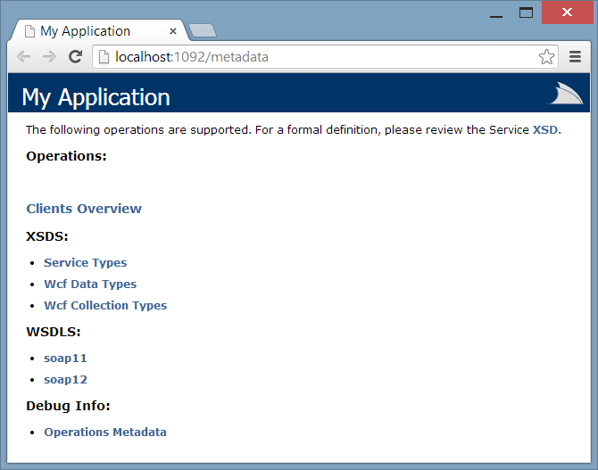
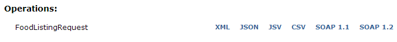
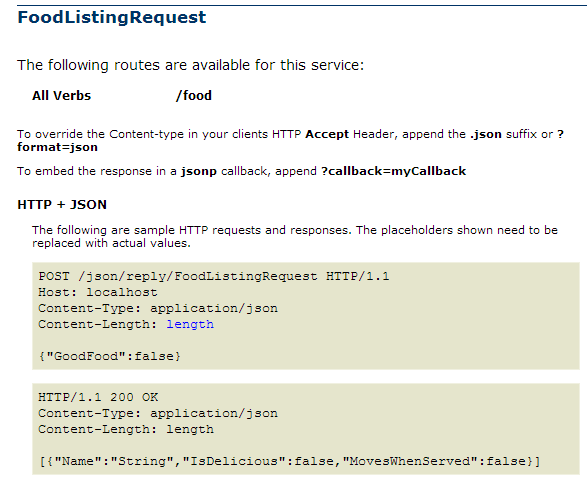
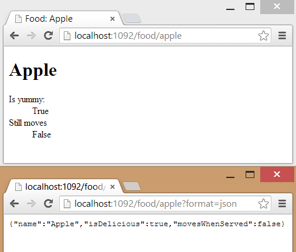

Title: ServiceStack Quick Start
Published: 9/8/2013
Tags:
  - C#
  - dotnet
  - ServiceStack
---

If you are a .NET developer and you need to make web services I want you to try [ServiceStack](https://servicestack.net/) **right now**.
Give me thirty minutes of your time and I will show you a glimpse of the basic features ServiceStack has to offer and how to use them.

## Project Setup

### Make a Project

Start off by making a new &quot;ASP.NET Empty Web Application&quot; however you feel comfortable.

1. Within Visual Studio navigate to File &darr; New &rarr; Project...
2. On the left navigate to Templates &darr; Other Project Types &darr; Visual Studio Solutions
3. Select the "Blank Solution" template, give it a name, then click the OK button
4. In your Solution Explorer right click the solution and select Add &rarr; New Project...
5. In the top-right search box enter "ASP.NET Empty Web Application" and select the C# variant
6. Make sure to select .NET Framework 4 or newer at the top
7. Give the project a name and click OK

### Reference ServiceStack

Next we need to download and reference ServiceStack. The best way to do this is through NuGet.
If you don't have NuGet (Visual Studio before 2012) you can head over to the [NuGet website](http://www.nuget.org/) to get it.
While we are adding ServiceStack lets add ServiceStack.Razor as well, it's neat.

1. Right click on your web project and select Manage NuGet Packages...
2. Within the left pane select "NuGet official package source" under the "Online" category
3. Search in the top-right for "ServiceStack"
4. Select then click the Install button for the following packages:
  - ServiceStack webservice framework: Faster, Cleaner, Modern WCF alternative (_ServiceStack_)
  - ServiceStack.Razor - ServiceStack's HTML story including MVC Razor (_ServiceStack.Razor_)

### Web.config Ceremony

While ServiceStack isn't big on using configuration files we still need to tell ASP.NET to handle requests with ServiceStack.
Either merge or replace your Web.config with the following config XML:

```xml
<?xml version="1.0"?>
<configuration>
  <system.web>
    <compilation debug="true" targetFramework="4.0">
      <assemblies>
        <add assembly="System.Web.WebPages.Razor, Version=1.0.0.0, Culture=neutral, PublicKeyToken=31BF3856AD364E35" />
      </assemblies>
      <buildProviders>
        <add extension=".cshtml" type="ServiceStack.Razor.CSharpRazorBuildProvider, ServiceStack.Razor" />
      </buildProviders>
    </compilation>
  </system.web>
  <system.webServer>
    <handlers>
      <add path="*" name="ServiceStack.Factory" type="ServiceStack.WebHost.Endpoints.ServiceStackHttpHandlerFactory, ServiceStack" verb="*" preCondition="integratedMode" resourceType="Unspecified" allowPathInfo="true" />
    </handlers>
  </system.webServer>
  <appSettings>
    <add key="webPages:Enabled" value="false" />
  </appSettings>
</configuration>
```

### Application Host

Next we need to add the core of the application and initialize it when the web application starts.

1. Right click on your web project and select "Add" &rarr; "New Item..."
2. Add a new C# Class file named "AppHost.cs" (_under the Code category_)
3. Add a using statement at the top of AppHost.cs: `using ServiceStack.WebHost.Endpoints;`
4. Implement AppHostBase in your new AppHost class:
   ```csharp
   public class AppHost : AppHostBase
   {
       public AppHost() : base("My Application", typeof(AppHost).Assembly) { }
       public override void Configure(Funq.Container container) {
           ; // TODO: configure this application
       }
   }
   ```
5. Right click on your web project again and select "Add" &rarr; "New Item..."
6. Add a new C# "Global Application Class" (_Found under the Web category_) with the default name of Global.asax
7. Initialize your app host within the <b>Application_Start</b> method of Global.asax.cs
   ```csharp
   protected void Application_Start(object sender, EventArgs e) {
       new AppHost().Init();
   }
   ```

### Try It

Just run the web application from Visual Studio and you should be presented with a mostly empty metadata page.



## Serve Up Some Data

I don't know about your specific scenarios but when I make web services it often involves me taking data from over here and shoving it down some HTTP tubes over there.
ServiceStack makes this workflow **really** easy.

### A Sample Data Store

For this example lets make a model and data store for some food.
It's often a good idea to put your models in another assembly from the API but this is an example so let that slide.
Add the following model and model collection.

Make Food.cs:

```csharp
public class Food
{

    public Food() { }
    public Food(string name) {
        Name = name;
    }

    public string Name { get; set; }
    public bool IsDelicious { get; set; }
    public bool MovesWhenServed { get; set; }
}
```

Make FoodListing.cs:

```csharp
using System;
using System.Collections.Generic;
using System.Linq;

public class FoodListing : List&lt;Food&gt;
{
    public IEnumerable&lt;Food&gt; GetAllFoods() {
        return this.AsEnumerable();
    }

    public IEnumerable&lt;Food&gt; GetEdibleFoods() {
        return this.Where(x => x.IsDelicious || !x.MovesWhenServed);
    }

    public Food GetFood(string name) {
        return this.FirstOrDefault(x => String.Equals(name, x.Name, StringComparison.OrdinalIgnoreCase));
    }

}
```

ServiceStack already has IoC and DI ready for you, so lets use it. Head on over to the `Configure` method of your AppHost class and lets add a bit to it.

```csharp
public override void Configure(Funq.Container container) {
    container.Register(_ => new FoodListing {
        new Food("Apple"){IsDelicious = true},
        new Food("Eggplant"),
        new Food("Dried Fish Flakes"){MovesWhenServed = true},
        new Food("Gelatin Desserts"){IsDelicious = true, MovesWhenServed = true}
    });
}
```

### A Basic Service

Lets serve up our food data by making two quick services.

1. Add a new C# code file within your web project named FoodService.cs or something similar
2. First add some using statements:
   ```csharp
   using System.Collections.Generic;
   using System.Linq;
   using System.Net;
   using ServiceStack.Common.Web;
   using ServiceStack.ServiceInterface;
   using ServiceStack.ServiceHost;
   ```
3. Next define the service code:
   ```csharp
   [Route("/food")] // maps the URI to the request model
   public class FoodListingRequest : IReturn&lt;List&lt;Food&gt;&gt;
   {
       public bool? GoodFood { get; set; }
   }
   
   public class FoodListingService : Service
   {
       public FoodListing Listing { get; set; } // we don't assign to this
   
       public List&lt;Food&gt; Any(FoodListingRequest request) {
           var results = request.GoodFood.GetValueOrDefault()
               ? Listing.GetEdibleFoods()
               : Listing.GetAllFoods();
           return results.ToList();
       }
   }
   
   [Route("/food/{Name}")]
   [Route("/food/details")]
   public class FoodDetailsRequest : IReturn&lt;Food&gt;
   {
       public string Name { get; set; }
   }
   
   public class FoodDetailsService : Service
   {
       public FoodListing Listing { get; set; }
   
       public Food Any(FoodDetailsRequest request) {
           var result = Listing.GetFood(request.Name);
           if(result == null)
               throw new HttpError(
                   HttpStatusCode.NotFound,
                   "food-not-found",
                   "The requested food was not found in the listing.");
           return result;
       }
   }
   ```

Notice how we never assigned a value to "Listing."
Instead ServiceStack is going to populate that from the IoC container we worked out previously.

### Use It

That is all it takes to make a service. Yes really, check this out!
Run the web project and navigate to the metadata page.
It should look similar to what you saw before but now there is a listing with your new service and the various
formats that it supports.



Click on one of those metadata links like the one for JSON and you should see a nice quick desccription of how to interact with the service.



Unless you are Comic Book Guy this is awesome! Now go make a call to the service: `/food` .
You get a nice default HTML view of the data, very handy for a quick look at your output. ServiceStack
relies on HTTP header information to determine the right content type. Your browser wants HTML so ServiceStack
complies. You can easily override this, try `/food?format=json` .

## Prettify

While the default HTML representation is nice and the JSON looks good enough you may want to have a bit more control.

### JSON Serialization Options

The JSON serialization can be configured easily.
You can set global JSON serialization options within the Configure method of your AppHost class.
As an example here is how to force camel casing:

```csharp
JsConfig.EmitCamelCaseNames = true;
```

If you think like I do the mutation of a static property probably gave you a bad feeling.
To make you feel better the configuration class has scoping capabilities too:

```csharp
using (JsConfig.BeginScope()) {
    JsConfig.DateHandler = JsonDateHandler.ISO8601;
    ; // some JSON serialization code
}
```

### Razor Views

Another really cool aspect to ServiceStack is how it manages the serialization of your response message for the client.
Just like with JSON you can configure how HTML is returned when it is requested by the client. ServiceStack has basic
Razor support that can be used to either render response messages or to just make basic Razor pages. Lets make a quick
index page and a details page using Razor.

Add the following line to your AppHost.Configure method to enable Razor. _Make sure you installed the Razor NuGet package from before._

```csharp
Plugins.Add(new RazorFormat()); // add razor and .md functionality
```

Next lets add the index page that will list out all the food. Add a new file to the project named default.cshtml

1. Right click on your web project and select "Add" &rarr; "New Item..."
2. Search for "html" in the top-right
3. Select "HTML Page"
4. Name the file "default.cshtml" (_be sure to use the cshtml extension_)
5. Click "Add"

Lets make default.cshtml look like this:

```html
@inherits ServiceStack.Razor.ViewPage
@{
  // get the singleton instance of the food listing
  var foodListing = AppHost.TryResolve<FoodListing>();
}
<!DOCTYPE html>
<html xmlns="http://www.w3.org/1999/xhtml">
<head>
  <title>FOOD!</title>
</head>
<body>
  <h1>
    <blink><marquee>FOOD!</marquee></blink>
  </h1>
  <center>
    <table border="20" cellpadding="20" cellspacing="5">
      @oreach (var food in foodListing.GetAllFoods()) {
        <tr><td><a href="@Url.Content("/food/details?name=" + Uri.EscapeDataString(food.Name))">@food.Name</a></td></tr>
      }
    </table>
  </center>
</body>
</html>
```

Stylish! Now lets make a view for the `Food` model.
ServiceStack has a convention where Razor views for models should go into the "views" folder
and they should have the same name as the model they are associated with.

1. Right click on your web project and select "Add" &rarr; "New Folder"
2. Name the folder "views"
3. Right click on the "views" folder and select "Add" &rarr; "New Item..."
4. Select "HTML Page"
5. Name the file "Food.cshtml" (_be sure to use the cshtml extension_)

Lets make Food.cshtml look like this:

```html
@inherits ServiceStack.Razor.ViewPage<Food>
<!DOCTYPE html>
<html xmlns="http://www.w3.org/1999/xhtml">
<head>
  <title>Food: @Model.Name</title>
</head>
<body>
  <h1>@Model.Name</h1>
  <dl>
    <dt>Is yummy:</dt>
    <dd>@Model.IsDelicious</dd>
    <dt>Still moves</dt>
    <dd>@Model.MovesWhenServed</dd>
  </dl>
</body>
</html>
```

Simple! Navigate to your application root and give your basic web application a try.
Also try changing the format. Navigate to the following application URLs:

* `/food/Apple`
* `/food/Apple?format=json`



## Other Resources

* [ServiceStack GitHub Wiki](https://github.com/servicestack/servicestack/wiki)
* [Razor Rockstars Code](https://github.com/ServiceStack/RazorRockstars/tree/master/src/RazorRockstars.WebHost)
* [ServiceStack NuGet Packages](https://www.nuget.org/packages?q=servicestack)